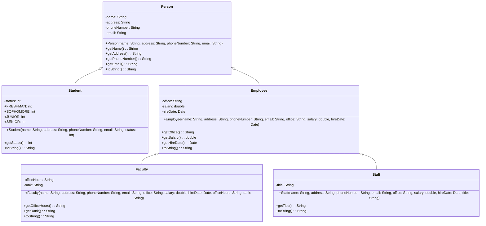

### 1. 题目要求

(继承与多态)设计Person(人)、Student(学生)、Employee(雇员)、Faculty(教员)、Staff(职员)
类，Student、Employee是Person的子类，Faculty、Staff是Employee的子类。所有人都有姓名、地址、电话号码、电子邮件地址。学生有班级状态：大一、大二、大三、大四，将这些状态定义为常量。一个雇员涉及办公室、工资、受聘日期(
使用Date类对象)。教员有办公时间、级别。职员有职务称号。覆盖每个类的toString()
方法，显示类别名称和姓名。画出这些类的UML图，实现上述要求，用主程序测试这些类并调用他们的toString()
。注意：作业提交请将程序和UML放在一个word文档提交

### 2. 代码实现

```java
import java.util.Date;

public class Person {
    private String name;
    private String address;
    private String phoneNumber;
    private String email;

    public Person(String name, String address, String phoneNumber, String email) {
        this.name = name;
        this.address = address;
        this.phoneNumber = phoneNumber;
        this.email = email;
    }

    public String getName() {
        return name;
    }

    public String getAddress() {
        return address;
    }

    public String getPhoneNumber() {
        return phoneNumber;
    }

    public String getEmail() {
        return email;
    }

    @Override
    public String toString() {
        return "Person: " + name;
    }
}

class Student extends Person {
    public static final String FRESHMAN = "Freshman";
    public static final String SOPHOMORE = "Sophomore";
    public static final String JUNIOR = "Junior";
    public static final String SENIOR = "Senior";

    private String status;

    public Student(String name, String address, String phoneNumber, String email, String status) {
        super(name, address, phoneNumber, email);
        this.status = status;
    }

    public String getStatus() {
        return status;
    }

    @Override
    public String toString() {
        return "Student: " + getName();
    }
}

class Employee extends Person {
    private String office;
    private double salary;
    private Date hireDate;

    public Employee(String name, String address, String phoneNumber, String email, String office, double salary, Date hireDate) {
        super(name, address, phoneNumber, email);
        this.office = office;
        this.salary = salary;
        this.hireDate = hireDate;
    }

    public String getOffice() {
        return office;
    }

    public double getSalary() {
        return salary;
    }

    public Date getHireDate() {
        return hireDate;
    }

    @Override
    public String toString() {
        return "Employee: " + getName();
    }
}

class Faculty extends Employee {
    private String officeHours;
    private String rank;

    public Faculty(String name, String address, String phoneNumber, String email, String office, double salary, Date hireDate, String officeHours, String rank) {
        super(name, address, phoneNumber, email, office, salary, hireDate);
        this.officeHours = officeHours;
        this.rank = rank;
    }

    public String getOfficeHours() {
        return officeHours;
    }

    public String getRank() {
        return rank;
    }

    @Override
    public String toString() {
        return "Faculty: " + getName();
    }
}

class Staff extends Employee {
    private String title;

    public Staff(String name, String address, String phoneNumber, String email, String office, double salary, Date hireDate, String title) {
        super(name, address, phoneNumber, email, office, salary, hireDate);
        this.title = title;
    }

    public String getTitle() {
        return title;
    }

    @Override
    public String toString() {
        return "Staff: " + getName();
    }
}

import java.util.Date;

public class Test {
    public static void main(String[] args) {
        Person person = new Person("John Smith", "123 Main St", "555-1234", "john.smith@example.com");
        System.out.println(person.toString());

        Student student = new Student("Jane Doe", "456 Oak St", "555-5678", "jane.doe@example.com", Student.JUNIOR);
        System.out.println(student.toString());

        Date hireDate = new Date();
        Employee employee = new Employee("Bob Johnson", "789 Maple St", "555-9012", "bob.johnson@example.com", "123", 50000, hireDate);
        System.out.println(employee.toString());

        Faculty faculty = new Faculty("Alice Brown", "321 Pine St", "555-3456", "alice.brown@example.com", "456", 80000, hireDate, "9-11am", "Professor");
        System.out.println(faculty.toString());

        Staff staff = new Staff("Tom Wilson", "654 Elm St", "555-7890", "tom.wilson@example.com", "789", 40000, hireDate, "Manager");
        System.out.println(staff.toString());
    }
}
```

### 3. 结果展示





